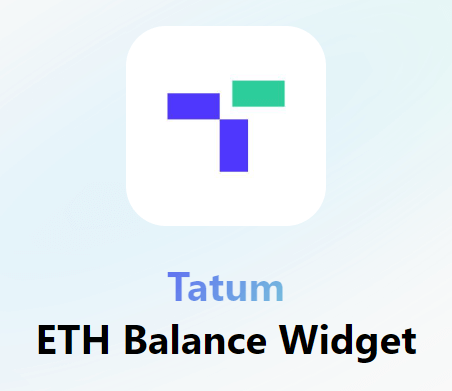

# Ethereum Balance Widget



A simple widget to check Ethereum wallet balances using the Tatum API, built with Preact and Vite.

You can access the live version of the widget [here](https://ethereum-balance-widget.vercel.app/).

## Getting Started

Follow these steps to get the project running locally:

### 1. Clone the Repository

Clone the repository to your local machine:

```bash
git clone https://github.com/acalic/ethereum-balance-widget.git
cd ethereum-balance-widget
```

### 2. Install Dependencies

Install the necessary dependencies with yarn:

```bash
yarn install
```

### 3. Set Up Environment Variables

Before running the project, make sure you set up the required environment variables.

Create a .env file in the root directory of your project and add the following:

```env
VITE_TATUM_API_KEY="YOUR API KEY"
```

This key is used to connect to the Tatum API.

### 4. Running the Project

Run the following commands based on your needs:

- yarn dev: Starts a development server at http://localhost:5173/ with hot module reloading.

- yarn build: Builds the project for production. The output will be placed in the dist/ folder.

- yarn preview: Serves the production build at http://localhost:4173/, so you can preview the final output locally.

### Project Structure

- src/: Contains the source code for the project, including components, styles, and assets.
- public/: Contains public assets like images and icons that are accessible by URL.
- dist/: The build output directory, generated by yarn build.
- vite.config.js: The Vite configuration file, where build and plugin settings are configured.
- .gitignore: A file that lists the files and directories that Git should ignore.
- .env: Environment file for storing sensitive information like your Tatum API key.

### Technologies Used
- Preact: A fast, 3kB alternative to React.
- Vite: A next-generation, fast build tool.
- Ethereum: The widget uses Ethereum APIs to check wallet balances.